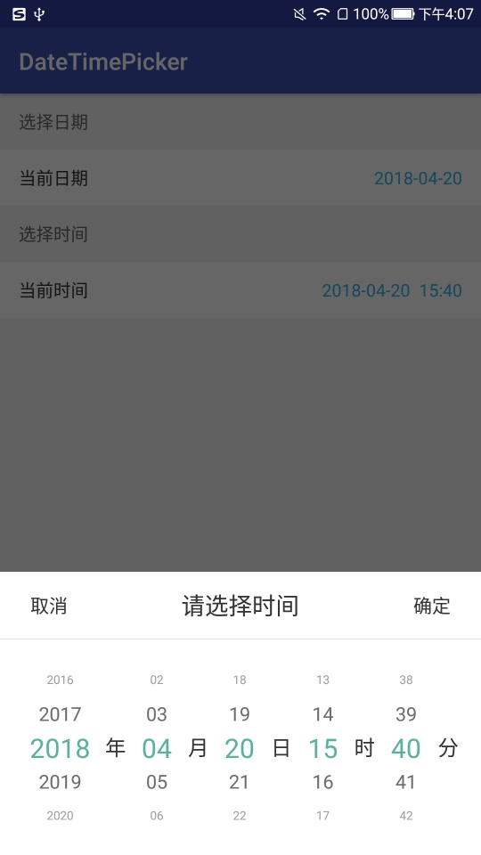

# DateTimePicker

## Screenshot
  


## Link
[<h3>DateTimePicker</h3>](../../DateTimePickerLibrary/src/main/java/jsc/lib/datetimepicker/widget)

## Attributions
[DateTimePicker.Builder](../../DateTimePickerLibrary/src/main/java/jsc/lib/datetimepicker/widget/DateTimePicker.java):

| 成员变量 | 方法 | 含义 |
| :--- | :--- | :--- |
| title | setTitle(CharSequence title) | 标题 |
| cancel | setCancel(CharSequence cancel) | 取消 |
| ok | setOk(CharSequence ok) | 确定 |
| year | setYear(CharSequence year) | 年 |
| month | setMonth(CharSequence month) | 月 |
| day | setDay(CharSequence day) | 日 |
| hour | setHour(CharSequence hour) | 时 |
| minute | setMinute(CharSequence minute) | 分 |
| titleTextColor | setTitleTextColor(@ColorInt int titleTextColor) | 标题颜色 |
| cancelTextColor | setCancelTextColor(@ColorInt int cancelTextColor) | 取消按钮颜色 |
| okTextColor | setOkTextColor(@ColorInt int okTextColor) | 确定按钮颜色 |
| yearLabelTextColor | setYearLabelTextColor(@ColorInt int yearLabelTextColor) | “年”文字颜色 |
| monthLabelTextColor | setMonthLabelTextColor(@ColorInt int monthLabelTextColor) | “月”文字颜色 |
| dayLabelTextColor | setDayLabelTextColor(@ColorInt int dayLabelTextColor) | “日”文字颜色 |
| hourLabelTextColor | setHourLabelTextColor(@ColorInt int hourLabelTextColor) |  “时”文字颜色|
| minuteLabelTextColor | setMinuteLabelTextColor(@ColorInt int minuteLabelTextColor) | “分”文字颜色 |
| textColor | setTextColor(@ColorInt int textColor) | 未选中的文字颜色 |
| selectedTextColor | setSelectedTextColor(@ColorInt int selectedTextColor) | 选中的文字颜色 |
| headerBackgroundColor | setHeaderBackgroundColor(@ColorInt int headerBackgroundColor) | 标题部分背景颜色 |
| bodyBackgroundColor | setBodyBackgroundColor(@ColorInt int bodyBackgroundColor) | 日期时间部分背景颜色 |
| segmentingLineColor | setSegmentingLineColor(@ColorInt int segmentingLineColor) | 标题部分与日期时间部分分割线颜色 |
| segmentingLineHeight | setSegmentingLineHeight(@IntRange(from = 1) int segmentingLineHeight) | 标题部分与日期时间部分分割线高度 |
| showType | setShowType(ShowType showType) | 显示级别 |
| keepLastSelected | setKeepLastSelected(boolean keepLastSelected) | 是否保留上一次的选择 |
| showYMDHMLabel | setShowYMDHMLabel(boolean showYMDHMLabel) | 是否显示"年"，"月"，"日"，"时"，"分" |
| loopScroll | setLoopScroll(boolean loopScroll) | 是否循环滚动，默认否 |

## Usage
```
        Calendar calendar = Calendar.getInstance();
        calendar.set(Calendar.YEAR, 2010);
        calendar.set(Calendar.MONTH, 0);
        calendar.set(Calendar.DAY_OF_MONTH, 1);
        calendar.set(Calendar.HOUR_OF_DAY, 0);
        calendar.set(Calendar.MINUTE, 0);
        Date startDate = calendar.getTime();

        calendar.set(Calendar.YEAR, 2030);
        calendar.set(Calendar.MONTH, 0);
        calendar.set(Calendar.DAY_OF_MONTH, 1);
        calendar.set(Calendar.HOUR_OF_DAY, 0);
        calendar.set(Calendar.MINUTE, 0);
        Date endDate = calendar.getTime();
        
        //方式一：构建自己的builder
        DateTimePicker.Builder TBuilder = new DateTimePicker.Builder(this)
                        .setTitle("选择年月日")
                        .setCancelTextColor(Color.RED)
                        .setOkTextColor(getResources().getColor(R.color.colorPrimary))
                        .setTitleTextColor(0xFF999999)
                        .setSelectedTextColor(getResources().getColor(R.color.colorAccent))
                        .setKeepLastSelected(true)
                        .setShowYMDHMLabel(true)
                        .setShowType(DateTimePicker.ShowType.DAY);
        DateTimePicker dateTimePicker1 = new DateTimePicker(this, new DateTimePicker.ResultHandler() {
            @Override
            public void handle(Date date) {
               
            }
        }, startDate, endDate, TBuilder);

        //方式二：使用默认的builder
        DateTimePicker dateTimePicker2 = new DateTimePicker(this, new DateTimePicker.ResultHandler() {
            @Override
            public void handle(Date date) {
                
            }
        }, startDate, endDate);
```
