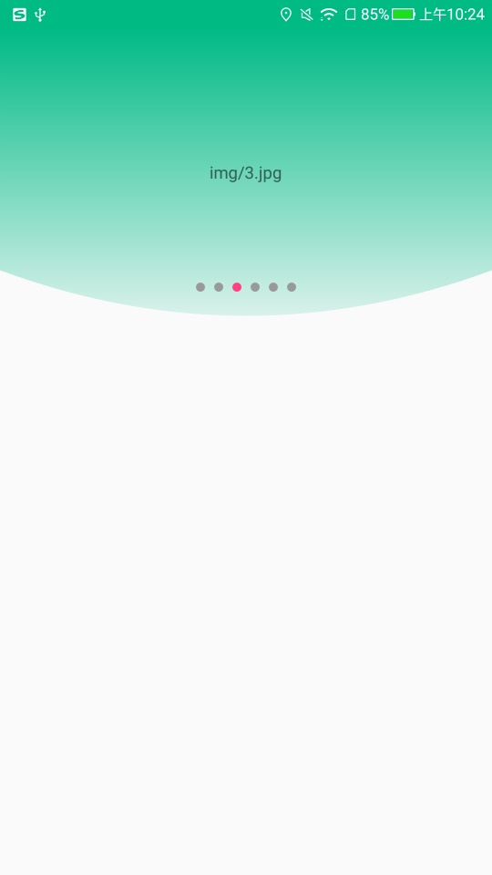

# Title
## Screenshot



## Link
[JSCBannerView](../../library/src/main/java/jsc/kit/bannerview)

## Attributions
`xmlns:app="http://schemas.android.com/apk/res-auto"`

| 参数 | 类型 | 含义 |
|:---|:---|:---|
| app:bv_indicator_padding_left | dimension | 底部指示器容器left padding，默认为`0` |
| app:bv_indicator_padding_right | dimension | 底部指示器容器right padding，默认为`0` |
| app:bv_indicator_padding_top | dimension | 底部指示器容器top padding，默认为`20px` |
| app:bv_indicator_padding_bottom | dimension | 底部指示器容器bottom padding，默认为`20px`。我们可通过设置它来控制底部指示器容器与底部的距离。 |
| app:bv_indicator_align | enum | 底部指示器容器对齐方式：`ALIGN_LEFT`左对齐、`ALIGN_CENTER`水平居中、`ALIGN_RIGHT`右对齐, 默认为`ALIGN_CENTER`|
| app:bv_view_pager_left_margin | dimension | `ViewPager`与其父`View`的左距离 |
| app:bv_view_pager_right_margin | dimension | `ViewPager`与其父`View`的右距离 |

## Functions

+ 泛型封装。支持各种数据类型。
+ 支持可循环轮播(Integer.MAX_VALUE方式实现。数据长度至少3个)。
+ 可DIY自己的indicator的view。
+ 可监听每一个banner的点击事件。

**特别提醒**：
+ 1、JSCBannerView只支持[BannerPagerAdapter](../../library/src/main/java/jsc/kit/bannerview/BannerPagerAdapter.java)适配器。
+ 2、[BannerPagerAdapter](../../library/src/main/java/jsc/kit/bannerview/BannerPagerAdapter.java)**必须**实现[PageAdapterItemLifeCycle](../../library/src/main/java/jsc/kit/bannerview/PageAdapterItemLifeCycle.java)接口定义Banner的视图。
+ 3、是否开启轮播功能是由[BannerPagerAdapter](../../library/src/main/java/jsc/kit/bannerview/BannerPagerAdapter.java)的构造方法里的参数`loop`决定。
+ 4、你可以实现[OnCreateIndicatorViewListener](../../library/src/main/java/jsc/kit/bannerview/OnCreateIndicatorViewListener.java)接口DIY底部指示器。
+ 5、你可以实现[OnPageAdapterItemClickListener](../../library/src/main/java/jsc/kit/bannerview/OnPageAdapterItemClickListener.java)接口监听每一个banner的点击事件。

## Usage
```
    <jsc.kit.bannerview.JSCBannerView
        android:id="@+id/banner_view"
        android:layout_width="match_parent"
        android:layout_height="240dp"
        android:clipChildren="false"
        app:bv_view_pager_left_margin="64dp"
        app:bv_view_pager_right_margin="64dp"
        app:bv_indicator_padding_bottom="20dp"
        app:bv_indicator_align="ALIGN_CENTER" />
```
```
    private void example1() {
        List<Banner> banners = new ArrayList<>();
        banners.add(new Banner("img/1.jpg"));
        banners.add(new Banner("img/2.jpg"));
        banners.add(new Banner("img/3.jpg"));
        banners.add(new Banner("img/4.jpg"));
        banners.add(new Banner("img/5.jpg"));
        banners.add(new Banner("img/6.jpg"));

        BannerPagerAdapter<Banner> adapter = new BannerPagerAdapter<>(true);
        adapter.setOnPageAdapterItemClickListener(new OnPageAdapterItemClickListener<Banner>() {
            @Override
            public void onPageAdapterItemClick(View view, Banner item) {
                Toast.makeText(view.getContext(), item.getUrl(), Toast.LENGTH_SHORT).show();
            }
        });
        adapter.setPageAdapterItemLifeCycle(new PageAdapterItemLifeCycle<Banner>() {
            @NonNull
            @Override
            public View onInstantiateItem(ViewGroup container, Banner item) {
                FrameLayout layout = new FrameLayout(container.getContext());
                TextView textView = new TextView(container.getContext());
                textView.setText(item.getUrl());
                FrameLayout.LayoutParams params = new FrameLayout.LayoutParams(ViewGroup.LayoutParams.WRAP_CONTENT, ViewGroup.LayoutParams.WRAP_CONTENT);
                params.gravity = Gravity.CENTER;
                layout.addView(textView, params);
                return layout;
            }

            @Override
            public boolean onDestroyItem(ViewGroup container, Object object) {
                return false;
            }
        });
        adapter.setOnCreateIndicatorViewListener(new OnCreateIndicatorViewListener<Banner>() {
            @Override
            public View onCreateIndicatorView(Context context, int index, Banner item) {
                return null;
            }
        });
        jscBannerView.setAdapter(adapter);
        adapter.setBannerItems(banners);
    }
```
轮播有两个先决条件：
+ 1、`BannerPagerAdapter adapter = new BannerPagerAdapter(true)`
+ 2、`adapter.getBannerItemNumber() >= 3`，即数据长度至少是3。
```
    @Override
    protected void onResume() {
        super.onResume();
        jscBannerView.start();
    }

    @Override
    protected void onPause() {
        super.onPause();
        jscBannerView.stop();
    }
```
设置PageTransformer实现酷炫效果：
```
jscBannerView.setPageTransformer(true, new ScaleTransformer());
```
你可以实现自己的PageTransformer，这里简单实现了四个Transformer：
+ 1、[AlphaPageTransformer](../../library/src/main/java/jsc/kit/bannerview/pageTransformer/AlphaPageTransformer.java)
+ 2、[DepthPageTransformer](../../library/src/main/java/jsc/kit/bannerview/pageTransformer/DepthPageTransformer.java)
+ 3、[ScaleTransformer](../../library/src/main/java/jsc/kit/bannerview/pageTransformer/ScaleTransformer.java)
+ 4、[ZoomOutPageTransformer](../../library/src/main/java/jsc/kit/bannerview/pageTransformer/ZoomOutPageTransformer.java)